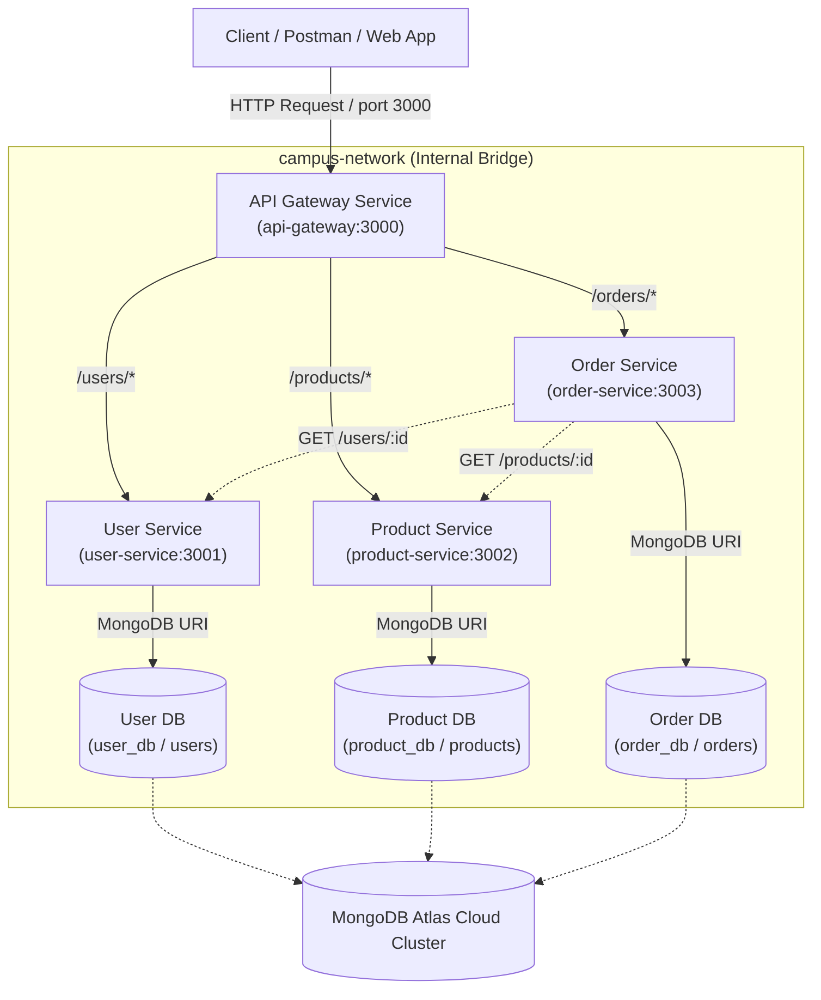

# Web Services & SOA — Lab 7: API Gateway, Service Discovery & Cloud Deployment

## 1. Project Overview & Lab 7 Objectives

This project builds upon the CampusConnect microservices architecture developed in Lab 6. In Lab 7, we introduce a central **API Gateway**, **configuration-based service discovery**, and **cloud deployment readiness for Render and MongoDB Atlas**.

### Key Lab 7 Objectives:
* **API Gateway Pattern**: Implement a unified entry point service using Node.js, Express, and `http-proxy-middleware`.
* **Security & Network Isolation**: Expose only host port `3000` for the API Gateway while keeping backend microservices (`user-service`, `product-service`, `order-service`) isolated inside the internal Docker network (`campus-network`).
* **Configuration-Based Service Discovery**: Route requests dynamically using environment variables (`USER_SERVICE_URL`, `PRODUCT_SERVICE_URL`, `ORDER_SERVICE_URL`) without hardcoding URLs in gateway source code.
* **Centralized Logging & Resilience**: Log HTTP method, request path, target service, response status code, and response duration at the gateway level. Return clean `503 Service Unavailable` JSON responses when downstream services fail.
* **Cloud & Atlas Readiness**: Bind all services to `0.0.0.0`, listen on `process.env.PORT`, and configure MongoDB Atlas database connection URIs.

---

## 2. Architecture Diagram



---

## 3. API Gateway Discussion & Rationale

### Why Use a Single API Gateway?
In microservices architecture, allowing clients to call individual microservices directly creates security vulnerabilities, tight coupling, and complex client code. A single API Gateway solves these problems by providing:

1. **Single Public Entry Point**: Clients interact exclusively with one base URL (`http://localhost:3000` locally or `https://<api-gateway-app>.onrender.com` in the cloud).
2. **Encapsulated Internal Network**: Hides internal microservice hostnames, container topology, and port numbers from external clients.
3. **Centralized Request Logging**: Consolidates request tracking into a single standard log output.
4. **Centralized Error Handling**: Intercepts downstream connection failures and returns clean HTTP error responses (`503 Service Unavailable`) instead of leaking internal error details or hanging client connections.

### Gateway Logging Details
For every incoming request, the gateway logs:
* **HTTP Method** (e.g., `GET`, `POST`, `PUT`, `DELETE`)
* **Request Path** (e.g., `/users/101`)
* **Target Microservice** (e.g., `User Service (http://user-service:3001)`)
* **Response Status Code** (e.g., `200`, `201`, `404`, `503`)
* **Processing Duration** (e.g., `12ms`)

*Sample Terminal Log:*
```text
[GATEWAY LOG] GET /health -> Target: Gateway | Status: 200 (4ms)
[GATEWAY LOG] POST /users -> Target: User Service (http://user-service:3001) | Status: 201 (18ms)
[GATEWAY LOG] GET /orders -> Target: Order Service (http://order-service:3003) | Status: 200 (6ms)
```

---

## 4. Error Handling (404 and 503 Responses)

### 1. Unmapped Gateway Route (404 Not Found)
When a request is sent to a route not mapped by the gateway (e.g., `GET /non-existent-route`), the gateway returns a clean `404 Not Found` JSON payload:
```json
{
  "error": "Not Found",
  "message": "No gateway route found for GET /non-existent-route"
}
```

### 2. Microservice Down / Unreachable (503 Service Unavailable)
If a targeted microservice is stopped, crashed, or unreachable, `http-proxy-middleware` catches the proxy connection error and returns a clean `503 Service Unavailable` JSON payload:
```json
{
  "error": "Service Unavailable",
  "message": "The User Service is currently unreachable at http://user-service:3001.",
  "targetService": "User Service",
  "status": 503,
  "timestamp": "2026-10-03T19:50:00.000Z"
}
```

---

## 5. Configuration-Based Service Discovery

### Static vs. Dynamic Service Discovery
* **Configuration-Based / Static Discovery (Used in Lab 7)**:
  Service target locations are configured via environment variables (`USER_SERVICE_URL`, `PRODUCT_SERVICE_URL`, `ORDER_SERVICE_URL`). The gateway reads these values from `config.js` without requiring hardcoded URLs inside proxy route code. This allows changing service locations between local development, Docker Compose, and cloud deployment seamlessly.
* **Dynamic Service Discovery (Consul, Eureka, Kubernetes DNS)**:
  Microservice instances register themselves automatically with a service discovery registry upon startup and deregister upon shutdown.
* **What Dynamic Discovery Provides Beyond Static Config**:
  * Real-time automatic registration/deregistration of scaling instances.
  * Active heartbeat health checks to route traffic away from unhealthy nodes.
  * Dynamic client-side and server-side load balancing across autoscaled instances.

---

## 6. API Gateway Routes Table

All client requests must be sent to the API Gateway on port `3000` (or the cloud gateway URL).

| Client Request Path | Target Microservice | Destination URL | Purpose |
| :--- | :--- | :--- | :--- |
| `GET /health` | **API Gateway** | Internal Handler | Gateway status & route health check |
| `/users/*` | **User Service** | `USER_SERVICE_URL` | User management CRUD endpoints |
| `/products/*` | **Product Service** | `PRODUCT_SERVICE_URL` | Product catalog CRUD endpoints |
| `/orders/*` | **Order Service** | `ORDER_SERVICE_URL` | Order processing endpoints |

### Endpoints List
* **Gateway**: `GET /health`
* **Users**: `POST /users`, `GET /users`, `GET /users/:id`, `PUT /users/:id`, `DELETE /users/:id`
* **Products**: `POST /products`, `GET /products`, `GET /products/:id`, `PUT /products/:id`, `DELETE /products/:id`
* **Orders**: `POST /orders`, `GET /orders`, `GET /orders/:id`

---

## 7. Docker Compose & Internal Networking

In `docker-compose.yml` (and `compose.yaml`), internal network security is enforced:
* **Gateway Port Exposure**: Only `api-gateway` maps a host port (`3000:3000`).
* **Microservice Isolation**: `ports:` mappings are removed from `user-service`, `product-service`, and `order-service`.
* **Service Name Routing**: Microservices communicate internally on the `campus-network` bridge using container service names:
  * `USER_SERVICE_URL=http://user-service:3001`
  * `PRODUCT_SERVICE_URL=http://product-service:3002`
  * `ORDER_SERVICE_URL=http://order-service:3003`

---

## 8. Environment Variables Reference

| Service | Environment Variable | Example Value (Local / Docker) | Purpose |
| :--- | :--- | :--- | :--- |
| **`api-gateway`** | `PORT` | `3000` | Gateway listening port |
| | `USER_SERVICE_URL` | `http://user-service:3001` | Target URL for `/users` |
| | `PRODUCT_SERVICE_URL` | `http://product-service:3002` | Target URL for `/products` |
| | `ORDER_SERVICE_URL` | `http://order-service:3003` | Target URL for `/orders` |
| **`user-service`** | `PORT` | `3001` | Service listening port |
| | `MONGODB_URI` | `mongodb://user-db:27017/user_db` | MongoDB connection URI |
| **`product-service`** | `PORT` | `3002` | Service listening port |
| | `MONGODB_URI` | `mongodb://product-db:27017/product_db` | MongoDB connection URI |
| **`order-service`** | `PORT` | `3003` | Service listening port |
| | `MONGODB_URI` | `mongodb://order-db:27017/order_db` | MongoDB connection URI |
| | `USER_SERVICE_URL` | `http://user-service:3001` | Inter-service User validation URL |
| | `PRODUCT_SERVICE_URL` | `http://product-service:3002` | Inter-service Product validation URL |

---

## 9. MongoDB Atlas Cloud Database Setup

The project uses **one MongoDB Atlas cluster** housing **three distinct databases**:
1. `user_db` → `users` collection (Managed by User Service)
2. `product_db` → `products` collection (Managed by Product Service)
3. `order_db` → `orders` collection (Managed by Order Service)

### Cloud MongoDB URI Format (Configured on Render)
* **User Service**: `mongodb+srv://<username>:<password>@<cluster>/user_db?retryWrites=true&w=majority`
* **Product Service**: `mongodb+srv://<username>:<password>@<cluster>/product_db?retryWrites=true&w=majority`
* **Order Service**: `mongodb+srv://<username>:<password>@<cluster>/order_db?retryWrites=true&w=majority`

---

## 10. Render Cloud Deployment Settings

When deploying to **Render**, create 4 separate Web Services with the following build, start, and health-check configurations:

| Service Name | Root Directory | Build Command | Start Command | Health Check Path | Required Environment Variables |
| :--- | :--- | :--- | :--- | :--- | :--- |
| **`user-service`** | `user-service` | `npm install` | `npm start` | `/` | `PORT`, `MONGODB_URI` |
| **`product-service`** | `product-service` | `npm install` | `npm start` | `/` | `PORT`, `MONGODB_URI` |
| **`order-service`** | `order-service` | `npm install` | `npm start` | `/` | `PORT`, `MONGODB_URI`, `USER_SERVICE_URL`, `PRODUCT_SERVICE_URL` |
| **`api-gateway`** | `api-gateway` | `npm install` | `npm start` | `/health` | `PORT`, `USER_SERVICE_URL`, `PRODUCT_SERVICE_URL`, `ORDER_SERVICE_URL` |

---

## 11. Local & Cloud Testing Instructions

### Local Testing (Docker Compose)
1. Build and start containers:
   ```bash
   docker compose up --build -d
   ```
2. Verify container status:
   ```bash
   docker compose ps
   ```
3. Test Gateway health:
   ```bash
   curl http://localhost:3000/health
   ```

### Postman Testing (Local & Cloud)
1. Import `Lab7_APIGateway.postman_collection.json` into Postman.
2. The collection includes a collection variable named `gatewayUrl`:
   * **Local Testing**: Set `gatewayUrl` to `http://localhost:3000`.
   * **Cloud Testing**: Set `gatewayUrl` to your deployed Render URL (e.g., `https://<your-api-gateway-app>.onrender.com`).
3. Run the requests sequentially:
   * `1. Gateway Health Check (GET /health)`
   * `2. User Service - Create Initial User (POST /users)`
   * `3. User Service - Get All Users (GET /users)`
   * `7. Product Service - Create Initial Product (POST /products)`
   * `8. Product Service - Get All Products (GET /products)`
   * `12. Order Service - Create Order (POST /orders)`
   * `13. Order Service - Get All Orders (GET /orders)`
   * `15. Gateway Error Handling - Invalid Route (GET /non-existent-route)` → Expects `404 Not Found`
   * `16. Gateway Error Handling - Service Unavailable` → Expects `503 Service Unavailable`

---

## 12. Explanation: Empty MongoDB Atlas Databases

When microservices are first deployed to a fresh MongoDB Atlas cluster:
* `GET /users`, `GET /products`, and `GET /orders` will return `[]` (empty array) with HTTP status `200 OK`.
* **This is completely expected behavior** because a new Atlas database contains no documents yet.
* Executing `POST /users`, `POST /products`, and `POST /orders` will automatically create the collections in Atlas and insert documents. Subsequent `GET` requests will then return the populated data.

---

## 13. Troubleshooting Guide

| Issue | Cause | Solution |
| :--- | :--- | :--- |
| **`503 Service Unavailable`** | Target microservice is offline or `USER_SERVICE_URL` is wrong | Check target service status and verify service URL env vars. |
| **`querySrv ECONNREFUSED` / Atlas Connection Failed** | MongoDB Atlas IP whitelist blocking connection or DNS SRV issues | Add `0.0.0.0/0` (Allow access from anywhere) in MongoDB Atlas Network Access rules. |
| **`EADDRINUSE` Port Conflict** | Port 3000, 3001, 3002, or 3003 is already in use locally | Terminate lingering node processes or update local port settings. |
| **Direct Microservice Access Fails** | Host ports were intentionally unmapped for security compliance | Route all requests through API Gateway (`http://localhost:3000`). |

---

## 14. Student Reflection

In Lab 6, client applications connected directly to individual microservices on separate host ports (`:3001`, `:3002`, `:3003`), exposing internal architecture and requiring clients to manage multiple URLs. In Lab 7, we implemented a centralized API Gateway on port `3000` that serves as a single entry point for all client requests. By adopting configuration-based service discovery using environment variables, target microservice locations can be updated dynamically without altering gateway source code. Unmapping microservice host ports enforces internal network security, while centralized request logging and structured 503 error handling significantly improve overall system observability, resilience, and cloud readiness.

---

## 15. Submission Evidence Checklist

- [ ] **Docker Compose Running**: Screenshot of `docker compose ps` showing containers running with only `api-gateway` exposing port 3000.
- [ ] **Gateway Health Check**: Screenshot of `GET http://localhost:3000/health` returning `200 OK`.
- [ ] **Gateway → User Service**: Screenshot of `GET http://localhost:3000/users` returning user list.
- [ ] **Gateway → Product Service**: Screenshot of `GET http://localhost:3000/products` returning product list.
- [ ] **Gateway → Order Service**: Screenshot of `POST http://localhost:3000/orders` returning created order (`201 Created`).
- [ ] **Request Logging**: Terminal screenshot showing `[GATEWAY LOG]` entries printed during request routing.
- [ ] **Unreachable Service Error Handling**: Screenshot of `GET http://localhost:3000/users` returning `503 Service Unavailable` when `user-service` is stopped.
- [ ] **Service Discovery Proof**: Screenshot/log showing environment variable changing target service location dynamically.
